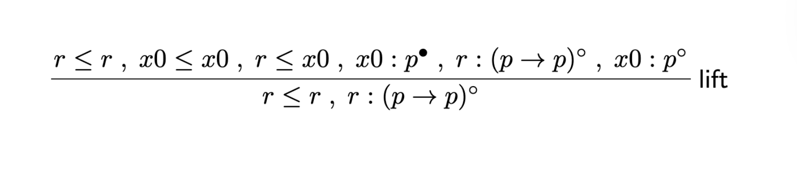

# labIK<sup>s</sup> Prover
This is a prover for the fully labelled sequent calculus **labIK<sup>s</sup>**. 

It supports:
* step-by-step proof search, 
* proof tree visualization, and 
* countermodel extraction.

## Installation

### Requirements
- Python >= 3.10
- LaTeX (pdflatex) - for visualization

### Setup
```
git clone https://github.com/zwanglogic/labIKs-Prover.git
cd prover
```
### How to run?
```
python3 main.py --formula ...
```
Depending on your system configuration, the Python interpreter may be invoked using different commands, such as `python`, `python3`, or `python3.x`. If the above command does not work, please try one of these alternatives.


## Quick Start Example
### Example 1 (not provable)
To prove $\Box\bot$:
```
python3 main.py --formula "Box(Bot())"
```
The prover produces the following output:
```
-------------------------- labIKs Prover --------------------------

Input formula: (Box(bot))

---------------- Step 0: Initial shrink-saturation ----------------

Current sequent is 

[r <= r, r : (Box(bot)) out]


------------------------ Step 1: Lifting ------------------------

---------------- Shrink-Saturation After Lifting ----------------

Current sequent is 

[x1 <= x1, r <= r, r <= x0, x0 <= x0, x0 R x1, x1 : bot out, r : (Box(bot)) out]


Not provable.
A countermodel has been generated.
```
The sequent printed immediately before the “Not provable” message is the one that defines the countermodel.
```
[x1 <= x1, r <= r, r <= x0, x0 <= x0, x0 R x1, x1 : bot out, r : (Box(bot)) out]
```
During the proof search, several .tex files are generated, each corresponding to a specific stage of the algorithm:
* `step_k_saturation.tex`
Contains the proof tree generated by the saturation phase at step k. This tree records all rule applications performed during saturation.
* `step_k_shrinking_leaf_i.tex`
Contains one of the leaf sequents produced by the shrinking phase at step k.
* `step_k_lift.tex`
Contains the proof tree for the lifting rule applied at step k.
* `countermodel.tex`(only when the formula is not provable)
Contains the countermodel extracted from the selected saturated leaf sequent.

To compile all generated LaTeX files into PDFs, simply run:
```
make pdf
```
This will produce a PDF file for each .tex file. For example, this is the countermodel file.
<p align="center">
  
</p>

To remove all files generated by the proof search and LaTeX compilation, run:
```
make clean
```
### Example 2 (provable)
To prove $p\to p$:
```
python3 main.py --formula "Imp(Prop('p'), Prop('p'))"  
```
The prover produces the following output:
```
-------------------------- labIKs Prover --------------------------

Input formula: (p -> p)

---------------- Step 0: Initial shrink-saturation ----------------

Current sequent is 

[r <= r, r : (p -> p) out]


------------------------ Step 1: Lifting ------------------------

---------------- Shrink-Saturation After Lifting ----------------

Provable :D
```
During the proof search, the lifting rule is applied. Below is an example of the corresponding visualization:
<p align="center">
  
</p>

## Formula Input Format
This tool does not rely on a custom parser.
Instead, formulas are provided directly as Python expressions, constructed using the logical syntax classes defined in the system.

All constructors can be freely nested, allowing arbitrary formulas to be expressed in a compositional way.

**Note on Quoting:** When running from the command line, enclose the **entire formula in double quotes (`"`)** and use **single quotes (`'`)** for inner variables.

| Constructor     | Logical Notation | Example of input format                         |
| :---            | :---             | :---                            |
| `Prop("p")`  | $p, q, \dots$    | `"Prop('p')"`                     |
| `Bot()`         | $\bot$           | `"Bot()"`                         |
| `And(A, B)`     | $A \land B$      | `"And(Prop('p'), Prop('q'))"`     |
| `Or(A, B)`      | $A \lor B$       | `"Or(Prop('p'), Prop('q'))"`      |
| `Imp(A, B)`     | $A \supset B$    | `"Imp(Prop('p'), Prop('q'))"`     |
| `Box(A)`        | $\Box A$         | `"Box(Prop('p'))"`                |
| `Diamond(A)`    | $\Diamond A$     | `"Diamond(Prop('p'))"`            |

## Makefile Utilities
For convenience, the repository provides a simple Makefile to automate common tasks, such as:
* Compile all generated LaTeX files
```
make pdf
```
* Clean generated files (Be careful!)
```
make clean
```
You can also display a short help message listing available Makefile commands:
```
make help
```
## References
The loop-check mechanism implemented in this prover is based on:

> 
*A Simple Loopcheck for Intuitionistic K*.  
M. Girlando, R. Kuznets, S. Marin, M. Morales, and L. Straßburger.
In Logic, Language, Information, and Computation (WoLLIC 2024). 
https://doi.org/10.1007/978-3-031-62687-6_4

## Acknowledgements
I would like to express my gratitude to my project supervisor, Dr. Marianna Girlando, for her invaluable guidance and continuous support throughout this project.

She provided deep insights into proof theory that went beyond the paper itself, clarifying the design motivations behind the calculus. These discussions greatly clarified the translation from abstract logic to executable code.

---
Maintained by Ziqi Wang. Any feedback or suggestions are highly appreciated. Please feel free to reach out via the email in my [GitHub Profile](https://github.com/zwanglogic)！