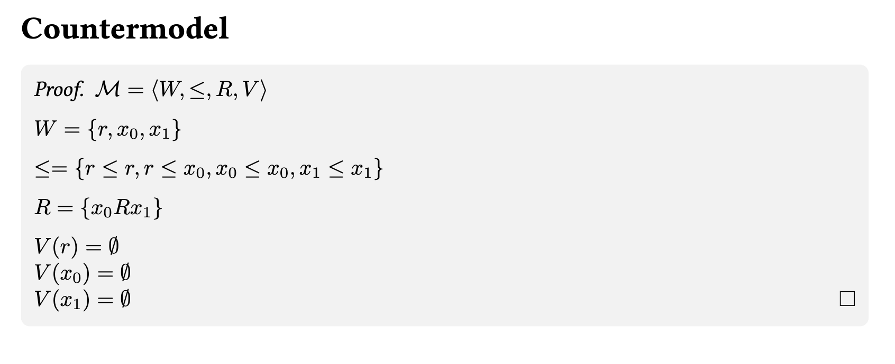

# labIks Prover
This is a prover for the fully labelled sequent calculus **labIKs**. 

It supports:
* step-by-step proof search, 
* proof tree visualization, and 
* countermodel extraction.

## Installation

### Requirements
- Python >= 3.10
- LaTeX (pdflatex) - for visualization

### Setup
```
git clone https://github.com/zwanglogic/labIKs-Prover.git
cd prover
```

## Quick Start Example
To prove $\Box\bot$:
```
python main.py --formula "Box(Bot())"
```
The prover produces the following output:
```
---------- labIKs Prover ----------

Input formula: Box(bot)

Step 0: Initial shrink-saturation

Step 1: Lifting

Shrink-Saturation After Lifting

Not provable.
A countermodel has been generated.
```
During the proof search, several .tex files are generated, containing proof trees and related artifacts. To compile all generated LaTeX files into PDFs, simply run:

```
make pdf
```
This will produce a PDF file for each .tex file. For example, this is the countermodel file.
<p align="center">
  
</p>

To remove all files generated by the proof search and LaTeX compilation, run:
```
make clean
```
## Formula Input Format
This tool does not rely on a custom parser.
Instead, formulas are provided directly as Python expressions, constructed using the logical syntax classes defined in the system.

All constructors can be freely nested, allowing arbitrary formulas to be expressed in a compositional way.

**Note on Quoting:** When running from the command line, enclose the **entire formula in double quotes (`"`)** and use **single quotes (`'`)** for inner variables.

| Constructor     | Logical Notation | Example of input format                         |
| :---            | :---             | :---                            |
| `Prop("p")`  | $p, q, \dots$    | `"Prop('p')"`                     |
| `Bot()`         | $\bot$           | `"Bot()"`                         |
| `And(A, B)`     | $A \land B$      | `"And(Prop('p'), Prop('q'))"`     |
| `Or(A, B)`      | $A \lor B$       | `"Or(Prop('p'), Prop('q'))"`      |
| `Imp(A, B)`     | $A \supset B$    | `"Imp(Prop('p'), Prop('q'))"`     |
| `Box(A)`        | $\Box A$         | `"Box(Prop('p'))"`                |
| `Diamond(A)`    | $\Diamond A$     | `"Diamond(Prop('p'))"`            |

## Makefile Utilities
For convenience, the repository provides a simple Makefile to automate common tasks, such as:
* Compile all generated LaTeX files
```
make pdf
```
* Clean generated files (Be careful!)
```
make clean
```
You can also display a short help message listing available Makefile commands:
```
make help
```
## References
The loop-check mechanism implemented in this prover is based on:

> 
*A Simple Loopcheck for Intuitionistic K*.  
M. Girlando, R. Kuznets, S. Marin, M. Morales, and L. Straßburger.
In Logic, Language, Information, and Computation (WoLLIC 2024). 
https://doi.org/10.1007/978-3-031-62687-6_4

## Acknowledgements
I would like to express my gratitude to my project supervisor, Dr. Marianna Girlando, for her invaluable guidance and continuous support throughout this project.

She provided deep insights into proof theory that went beyond the paper itself, clarifying the design motivations behind the calculus. These discussions greatly clarified the translation from abstract logic to executable code.

---
Maintained by Ziqi Wang. Any feedback or suggestions are highly appreciated. Please feel free to reach out via the email in my [GitHub Profile](https://github.com/zwanglogic)！